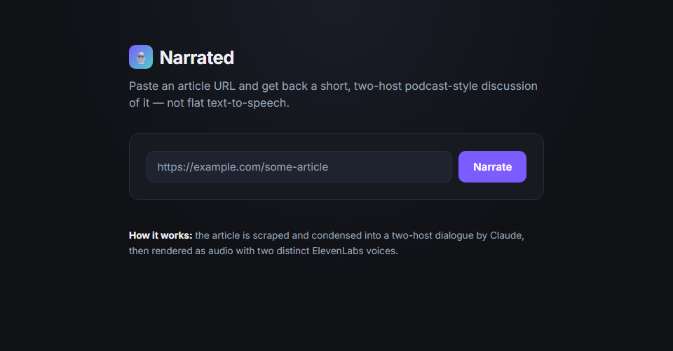
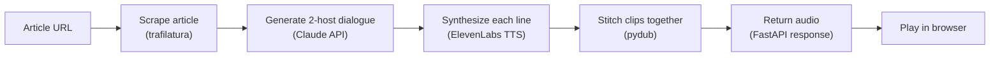
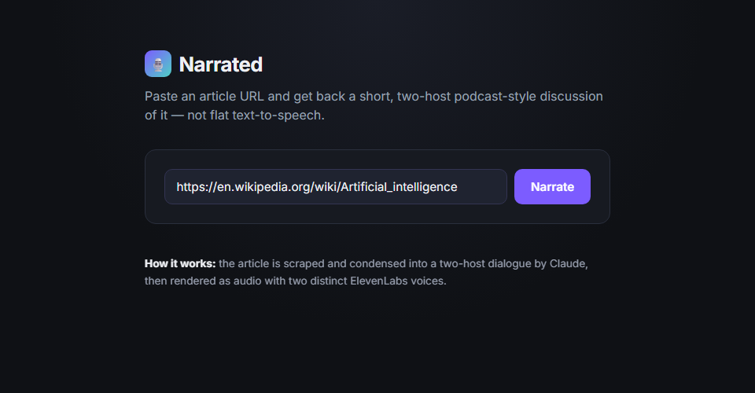

# Narrated

Turns any article URL into a short, two-host podcast-style audio clip — not flat text-to-speech, but a generated dialogue between two AI voices discussing the piece.



## Tech Stack
- **Backend:** FastAPI (Python)
- **Article extraction:** `trafilatura`
- **Script generation:** Claude API (Anthropic) — condenses the article into a two-host dialogue
- **Text-to-speech:** ElevenLabs API — one voice per host
- **Audio stitching:** `pydub`
- **Frontend:** React (Vite)

## Key Features
- Paste any article URL and get back a playable MP3 narration
- Two distinct AI voices (Alex and Sam) hold a short conversational discussion of the article instead of reading it verbatim
- Article text extraction handles arbitrary web pages, not just a fixed set of sites
- Clean error handling for unfetchable pages, short/invalid articles, and upstream API failures

## How It Works



1. You paste an article URL into the frontend.
2. The backend fetches and extracts the readable article text.
3. Claude condenses that text into a short two-host dialogue (JSON: speaker + line).
4. Each line is sent to ElevenLabs with a distinct voice per host.
5. The resulting clips are stitched into a single MP3 and streamed back to the browser.

## Screenshots

| Default state | Filled in |
|---|---|
|  |  |

## Setup

### Backend
```bash
cd backend
python -m venv .venv && source .venv/bin/activate  # or .venv\Scripts\activate on Windows
pip install -r requirements.txt
cp ../.env.example ../.env  # fill in ANTHROPIC_API_KEY and ELEVENLABS_API_KEY
uvicorn app.main:app --reload
```

### Frontend
```bash
cd frontend
npm install
npm run dev
```

The app runs on `http://localhost:5173` and talks to the backend on `http://localhost:8000`.

## Why I built this
Wanted a hands-on project using ElevenLabs' TTS API alongside an LLM for content generation, rather than a generic chatbot wrapper — a good demonstration of a full audio-generation pipeline end to end.
